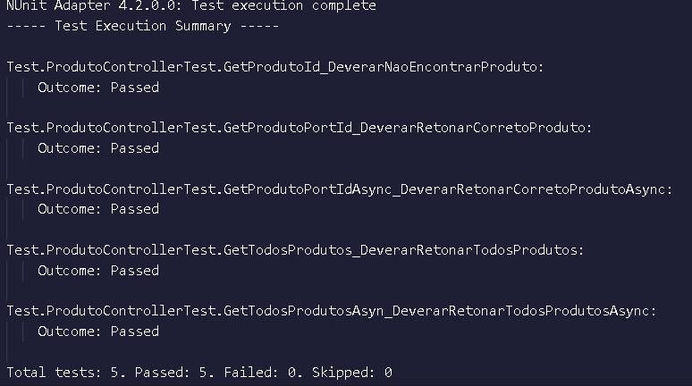

# Estudo de API Rest Concluída ✅
## INFORMAÇÃO IMPORTANTE SOBRE O PROJETO ⚡
`Projeto criado para fazer teste de unidade em sua solução e escrever métodos de teste que verificam os valores retornados de um método de controlador. Meu intuito com esse projeto é estudar.` 
## INFORMÇÕES DA API REST 📝
- Construido uma API REST utilizando .Net Core
- A API possui 3 operações:
  1) Registrar Produto;
  2) Buscar produto: Busca pelo Id da venda; e
  3) Buscar todos produtos.
- A aplicação não implementa os mecanismos de persistência em um banco de dados ou memória.

## PONTOS IMPORTANTES ⚠️
 - Arquitetura da aplicação;
 - Programação orientada a objetos;
 - Boas práticas e princípios como SOLID e DDD;
 - Testes unitários. Estudado duas formas de teste, uma que os dados são armazenados em uma lista e com um objeto mock; e
 - Uso correto do padrão REST;
 
 ## EVIDÊNCIAS DE QUE OS TESTE UNITÁRIO PASSARAM COM ÊXITO ☑️

Link para a classe de teste de ProdutoControllerTest: [Clique para ver](https://github.com/ttheusLima/Web_API-StoreApp/blob/main/Api/Test/ProdutoControllerTest.cs)

>

Link para a classe de teste de ProdutoServiceTest: [Clique para ver](Teste-ProdutoServiceTest.png)
>
